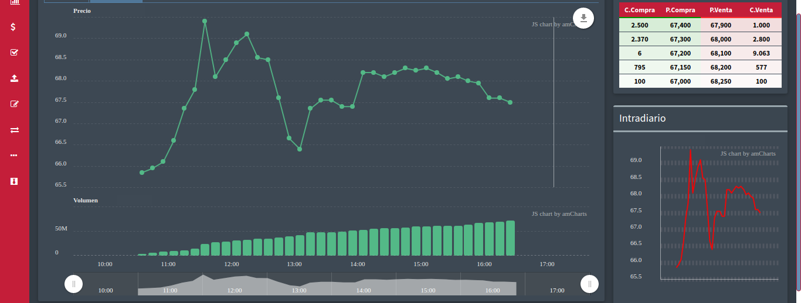

```{r setup, include=FALSE}
knitr::opts_chunk$set(echo = FALSE, fig.align = "center")
library(knitr)
```

# Observaciones

La acción del Banco Supervielle concluye la semana el vienes 25/07/19 en los $66.55 por acción con una mejora del 3% respecto al viernes de la semana pasada. En el año acumulado gana un 7% en pesos y cae 6% en dólares. En el gráfico semanal, el precio tuvo soporte en el 38% de retroceso desde el máximo marcado en el año.     

En el gráfico diario, el mercado mostró cara y cruz ya que comenzó la semana con un gap a la baja luego encontró soporte en los $60 y dejó una vela con un +7% que dejó contentos a más de un inversor.    

# Análisis      
  
En su historia el trayecto similar a 82 lo hizo en el plazo que va de 26 a 42 días: es decir tuvo subas rápidas. También tuvo una baja abrupta en el 2018, aquí esta el riesgo.

```{r}
knitr::include_graphics("SUPV_AT.png")
```

Gráfico con canal alcista de corto plazo, con soportes y resistencias. Un *stop loss* efectivo sería por debajo del soporte de 60, es decir en: 59.

```{r}

```

# Ejeucción de orden de compra    

```{r, eval=TRUE}
fecha_compra = lubridate::make_date(2019,07,29)
n_acciones = 1443
precio_entrada = 68.65
comision = 0.7
IVA = 100
capital_i = 100000
compra = n_acciones * precio_entrada    
```

Fecha de compra: `r fecha_compra`     
Precio por acción: $`r precio_entrada`     
Cantidad de acciones: `r n_acciones` 
Comisión: `r comision`%          
IVA y Derechos de Mercado: $`r IVA`    
Capital inicial: $100000      

# Proyección de orden de venta

El retorno esperado de la inversión debería mejorar el rendimiento de inversiones en renta fija (ej. FCI Quinquela Ahorro (cartera mayoritaria en LECAPS) tasa mensual 4.9% o Cauciones 4.04%) y ser mayor a la tasa de inflación jun-19 2.7% (proyectada a un año 30%).     

```{r}
tasa_referencia <- 0.05
umbral_mejor_opcion_30d <- 100000*0.05
precio_objetivo_min <- 105000/n_acciones
```

Bajo el escenario descripto la tasa de referencia es de `r tasa_referencia*100`%, el retorno mínimo a lograr en los próximos 30 días es de `r umbral_mejor_opcion_30d` y el precio objetivo mínimo de la catización debería alcanzar el valor de $`r round(precio_objetivo_min, digit = 2)`. Es decir, debe superar la primer resistencia para empezar a generar retorno positivo. Nuestro *take profit* estaría a partir de aquí hacia arriba según AT y coyuntura.          
  
CSC     
***   
