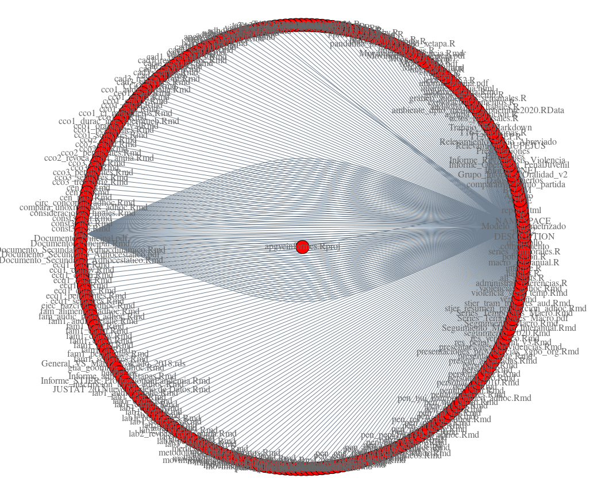

Hola, soy Sebastián Castillo gracias por visitarme, espero que algunas de estas ideas te sirvan de inspiración. Trabajo constestando preguntas que suponen investigar datos (a veces grandes y otras pequeños), identificando relaciones, patrones y modelos que nos ayudan a entender un problema. En este blog incluyo parte de ese trabajo y cosas que me ayudaron a realizarlo. Si tenés alguna consulta, y ya que llegaste hasta acá, con gusto te contesto por correo. 

 
*
Mi trabajo en una red: estos son los 3500+ documentos analíticos creados en el Poder Judicial
*

# Apuntes sobre Aprendizaje Automático, Modelos Estadísticos y NLP

- 2020-04-12: NLP for legal text: first steps (on google colab notebook) [link](https://colab.research.google.com/drive/1n_X-r1mXG5Z0VBkOHC9AtjO1lyY-kSpl)
- 2020-04-10: Legal Corpus from Supreme Court of Buenos Aires, Argentina. [link](https://github.com/castillosebastian/legal_corpus) 
- 2019-01-10: Modelos de Lenguaje. [link](https://castillosebastian.github.io/NLP/Modelos_de_Lenguaje.html)
- 2018-12-06: Qué y cómo aprenden las máquinas. [link](https://castillosebastian.github.io/epistemologia_formal/Qué-y-cómo-aprenden-las-redes-neuronales.html)
- 2015-09-01: Epistemología Formal. [link](https://castillosebastian.github.io/epistemologia_formal/epistemología_formal.html)

# Información sobre Estadística y Justicia 
- 2021-10-19: **Taller**: R para Estadística Judicial: Reproducibilidad y Automatización, JUFEJUS. [link](https://rpubs.com/ClaudioSebastianCastillo/824728)
- 2021-08-18: Informe: Análisis de Competencia:Juicios Ejecutivos, STJER. [link](https://drive.google.com/file/d/1dDFNL4FuZXTbRgkgeCCqwdbIs-ReQAsE/view?usp=sharing)
- 2021-06-23: **Video**: Actividad Judicial en Pandemia, Poder Judicial de Entre Ríos. [link](https://www.jusentrerios.gov.ar/2021/06/23/en-pandemia-2-millones-de-actos-procesales-y-mas-de-790-mil-presentaciones-digitales/)
- 2021-06-09: Resumen Ejecutivo: Actividad durante Pandemia marzo-2020/mayo-2021 STJER. [link](https://drive.google.com/file/d/11LdFkg4uwNK5DbWMQxuX6xX4mhBN7isp/view?usp=sharing)
- 2021-03-15: Informe: Datos sobre Narcomenudeo, STJER.[link](https://drive.google.com/file/d/139d_gQnthpbZq4YoCWSfMjBnaWXcHL94/view?usp=sharing) 
- 2020-12-22: Informe: Causas Iniciadas en Familia, Alimentos. [link](https://drive.google.com/file/d/1BUWpWQEZ3ZiI8OfHdPEP9deVKWn3SuiU/view?usp=sharing) 
- 2020-06-18: Informe: sobre Delitos Informáticos, STJER. [link](https://drive.google.com/file/d/1OK-8WCc6Tu446kGDANCQ9ot3Dns3ibM0/view?usp=sharing)
- 2020-06-01: Informe: sobre Violencia Familiar y/o contra la Mujer, STJER. [link](https://drive.google.com/file/d/1nT2BWfLuofVZqYpEOhsB5geX2yLC1Fdz/view?usp=sharing)  
- 2020-05-06: Informe: Presupuesto Prcial. sobre Bs.y Serv. STJER. [link](https://drive.google.com/file/d/14pbTFr4qBbKwVwLTbpM9WzfIr63yKXqh/view?usp=sharing)
- 2020-03-12: Informe:Duración de Procesos Civiles, STJER. [link](https://drive.google.com/file/d/1VLJP9UX7cxu-3FzoRY_jjYSn_4oVSc7K/view?usp=sharing)
- 2020-03-03: **Artículo**: Estadística Pública y Administración de Justicia, Medium.[link](https://medium.com/@castilloclaudiosebastian/estad%C3%ADstica-p%C3%BAblica-y-administraci%C3%B3n-de-justicia-d33141da0708)
- 2019-12-01: Informe: Sumario Estadístico 2018-2019, STJER. [link](https://drive.google.com/file/d/1UR95d93EFhNWeW38pGzx6zSLcbY4PzGz/view?usp=sharing)  

# Aplicaciones    
- 2019-11-01 *Tableros Públicos de Estadística*, Poder Judicial de Entre Ríos, Argentina [link](https://tablero.jusentrerios.gov.ar/)     
- 2019-01-10 *Word Predictor App*: algoritmo para procesamiento predictivo de próxima palabra. 
[link](https://castillocs.shinyapps.io/shiny_app/)    

# Sobre mi
[linkedin](https://www.linkedin.com/in/castillocs/) - [github](https://github.com/castillosebastian) - [bitbucket](https://bitbucket.org/apgye/) . ***castilloclaudiosebastian@gmail.com***

